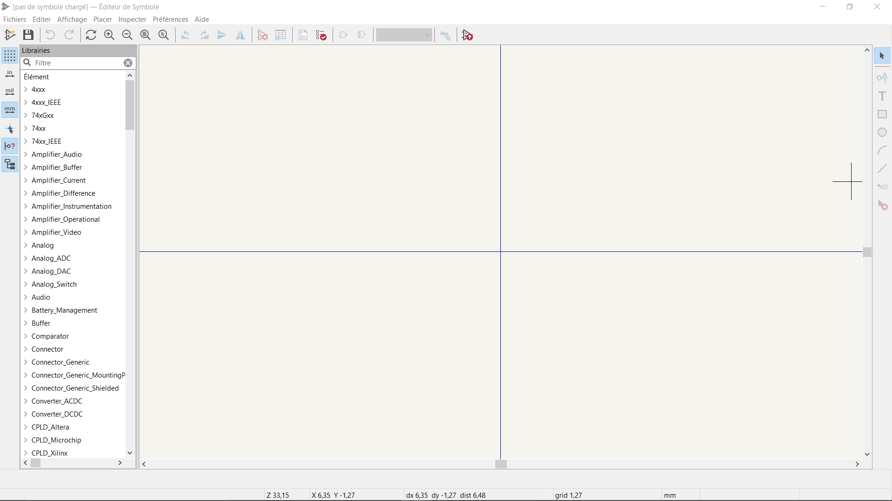
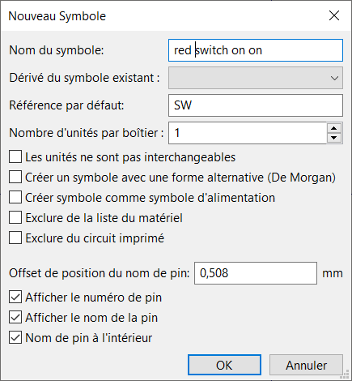
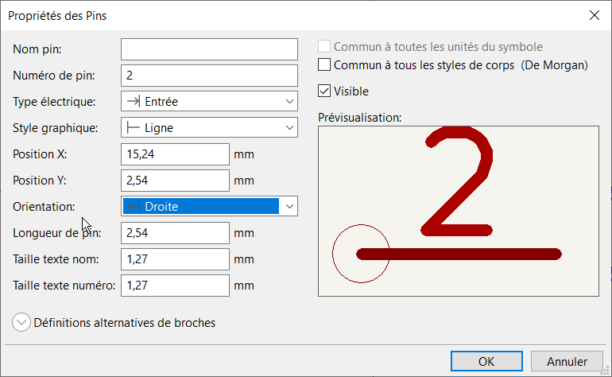
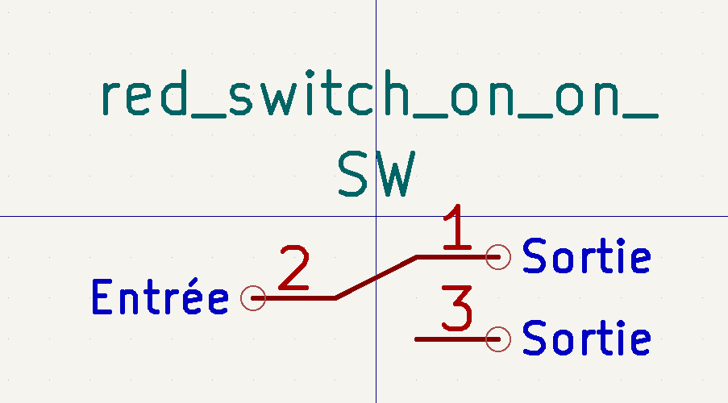
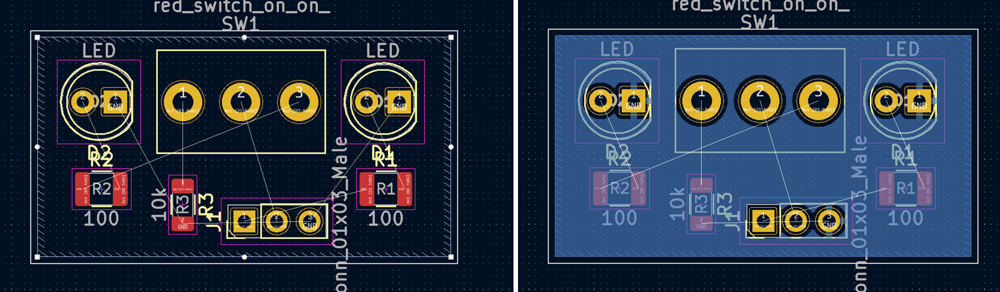
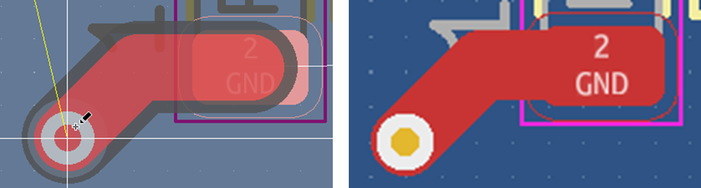
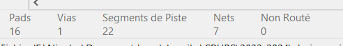
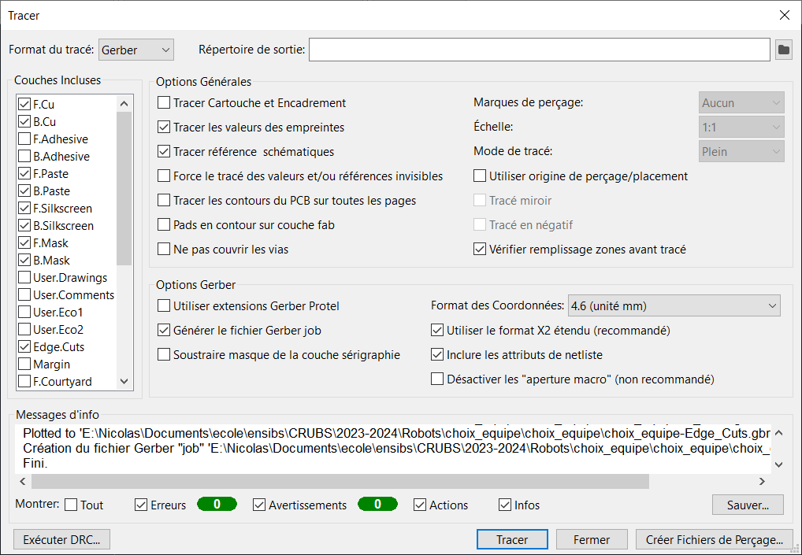

KiCad
=====

KiCad est une suite logicielle libre de conception pour l'électronique pour le dessin de schémas électroniques et la conception de circuits imprimés.

Cette page servira de tutoriel pour utiliser le logiciel KiCad V6.0 a travers un exemple. Vous y verrez :

#. Comment créer un projet
#. Réaliser le schéma électrique
#. Créer votre propre composant et son empreinte
#. Router votre circuit
#. Réaliser un plan de masse et des vias
#. Faire fabriquer cette carte a l'école ou avec jlcpcb

Le circuit
**********

L'exemple que nous allons suivre est la réalisation d'une carte permettant d'indiquer au robot le choix de l'équipe. Nous y trouverons un interrupteur pour choisir l'équipe et deux leds qui permettent de savoir quelle équipe est sélectionnée. Nous retrouverons 3 pins, 2 pour l'alimentation de la carte (gnd et 3.3v) et 1 pour l'information de l'équipe (3.3v ou 0v), ce dernier pin sera relier directement a la raspberry pi ce qui explique le choix d'une alimentation en 3.3v.

Je vous recommande de vérifier dans la mesure du possible votre circuit sous un simulateur tel que falstad (https://www.falstad.com/circuit/circuitjs.html) pour vous assurer qu'il n'y a aucun problème.

Voici le circuit que nous allons réaliser : 

.. image:: images/kicad/circuit_falstad.png
	:scale: 50 %
  	:align: center

Nouveau projet kicad
********************

Au démarrage de KiCad vous tomberez sur cette interface. On y retrouve tous les outils qui sont nécessaires a la création de notre pcb.

Commencer par cliquer sur "créer un nouveau projet", donnez lui un nom puis sélectionner le chemin d'enregistrement.

Notre projet est créé, nous pouvons maintenant rentrer dans l'éditeur de schématique.

Editeur de Schematique
======================

Etape 1 - premier composant
***************************

C'est sur cette interface que nous créerons notre schéma électrique en spécifiant les composants.

Pour ajouter des composants à la feuille, appuyez sur la touche A de votre clavier ou sur l'icône à droite de l'interface.

Une fenêtre s'ouvre, vous pouvez alors choisir un composant en le recherchant avec sa référence ou en fouillant. Au début trouver un composant est laborieux, mais avec le temps, vous les trouverez plus facilement.

Nous pouvons commencer à ajouter les résistances, les leds et les pins à notre circuit. Pour tourner un composant, vous pouvez appuyer sur la touche R.

Les leds se trouvent en recherchant simplement "R", les pins en recherchant "conn", les led avec "led"

.. image:: images/kicad/circuit_sans_int.png
	:scale: 50 %
	:align: center

Nous devons maintenant ajouter l'interrupteur, malheureusement le symbole correspondant n'existe pas forcément sur KiCad et nous allons devoir le créer nous mîmes. Pour cela, revenez sur le menu principal de KiCad et allez dans "Éditeur de Symbole."

Etape 2 - Editeur de symbole
****************************

Nous voila maintenant dans l'éditeur de symbole. Si vous n'avez jamais utilisé ce dernier, vous devez commencer par crier votre propre librairie a composant, pour cela rendez vous dans fichier>Ajouter Librairie...Choisissez Global dans la nouvelle fenêtre. Donnez-lui un nom, par exemple "ma_lib" et enregistrez l'a l'endroit proposer.

Effectuez un clique-droit sur votre librairie dans l'arbre de gauche et sélectionner "nouveau symbole". Spécifier les informations de votre composant, par exemple comme suit

Vous pouvez désormais ajouter les 3 pins de l'interrupteur en spécifiant le numéro de ces derniers.

Vous pouvez ensuite vous servir des éléments de tracé présents à droite de l'interface. Pour finir le tracer d'une ligne faite un clique droit > finir tracer.

N'oubliez pas d'enregistrer avant de quitter l'édition de symbole.

Etape 3 - finalisation schemat
******************************

De retour dans l'éditeur de schématique, vous pouvez maintenant ajouter le symbole que vous avez créé dans votre librairie et finaliser le circuit

.. image:: images/kicad/circuit_complet.png
	:scale: 50 %
	:align: center

Nous allons maintenant devoir spécifier le numéro de chaque composant. Pour cela, double-cliquer sur chaque composant pour ouvrir le menu des paramètres de ces derniers.

.. image:: images/kicad/parametre_composant.png
	:scale: 50 %
	:align: center

Et vous devez rentrer le numéro du symbole dans la première ligne. Vous devez avoir aucun composant avec la même référence. Vous pouvez par la même occasion spécifier la valeur des résistances pour vous aider.

Je vous recommande d'indiquer dans votre schéma la masse de votre circuit grâce à un label, cette étape est indispensable si vous souhaitez réaliser un plan de masse. Pour cela, choisissez "ajouter un label" dans les options à droite de l'interface. Spécifier son nom, par exemple "GND" puis sélectionner le fil concerné dans votre circuit

Voici le schéma désormais numéroté et avec le label

.. image:: images/kicad/circuit_fini.png
	:scale: 50 %
	:align: center

Nous allons maintenant devoir indiquer l'empreinte électrique de nos composants. En général un composant existe en composant traversant (THT) ou en composant monter en surface (CMS). De même ces deux type existe de plein de taille différente. Nous devons donc spécifier notre composant physique.

Pour cela double-cliquer sur chaque composant, dans la ligne "footprint" cliquer sur les 3 traits verticaux. Une nouvelle fenêtre s'ouvre, vous devez maintenant chercher l'empreinte de votre composant. Au début trouver la bonne empreinte est laborieux, mais avec le temps, vous les trouverez plus facilement.

.. image:: images/kicad/choix_empreinte.png
	:scale: 50 %
	:align: center

Ici, nous avons :

- Pour les résistances 100 ohm : Resistor_SMD:R1210_3225Metric
- Pour la résistance de 10kohm : Resistor_SMD:R1206_3216Metric
- Pour les leds : LED_THT:LED_D5.0mm
- Pour les pins : Connector_PinHeader_2.54mm:PinHeader_1x03_P2.54mm_Vertical

Nous avons le même problème que précédemment, notre interrupteur ne possède pas d'empreinte, nous devons la réaliser nous mîmes. Pour cela, revenez sur le menu principal de KiCad et allez dans "Éditeur d'empreinte."

Etape 4 - Editeur d'empreinte
*****************************

Si vous n'avez pas encore vous propre librairie d'empreinte, suivez les mêmes étapes que lors de la création de votre librairie de symbole.

Effectuez maintenant un clique droit sur votre librairie dans l'arbre de gauche puis nouvelle empreinte. Indiquer le nom de votre composant puis le type d'empreinte, pad traversant ou CMS

Lors de la création de votre composant, je vous recommande de jouer avec les paramètres de grille pour facilement dessiner à la bonne dimension. Vous avez deux principaux multiples de taille, soit un pas métrique soit un pas impérial. Sachant que la plus par des composants électriques suive un pas impérial. La plus courante étants l'entraxe de 2.54mm entre 2 pin dupont ce qui correspond a 1/10 de inch

Dans notre cas, je règle la grille à 0.500 mm, l'entraxe des pins de l'interrupteur étants de 4.500 mm.

Avec l'option pad qui se trouve à droite, vous pouvez ajouter les pads. En double-cliquant dessus, vous ouvriez les paramètres. 

.. image:: images/kicad/parametre_pad.png
	:scale: 50 %
	:align: center

Après avoir mesuré les pins de l'interrupteur he constate que ces derniers sont plus gros que la normale. Il faut ainsi modifier les dimensions du pad et du perçage comme ci-dessus.

Vous devez maintenant effectuer cette action pour tous les pads et vous pouvez vous aider de l'outil mesure pour les placer correctement. Attention, le numéro des pins est important et doit correspondre au pin du symbole.

Vous pouvez maintenant dessiner un rectangle qui indique les dimensions de votre composant, ici 8mm * 13mm. Attention à bien avoir sélectionné la couche F.Silscreen dans le volet de droite pour spécifier que ce rectangle est un marquage

.. image:: images/kicad/empreinte_rectangle.png
	:scale: 35 %
	:align: center

Vous pouvez maintenant enregistrer et quitter cette fenêtre.

Etape 5 - Passage dans l'editeur de Kicad
*****************************************

Cette dernière empreinte maintenant spécifié sur l'interrupteur, vous pouvez maintenant enregistrer, revenir au menu et sélectionner "éditeur de PCB KiCad"

Editeur de PCB KiCad
====================

Nous voila maintenant sur l'éditeur de PCB.

.. image:: images/kicad/kicad_editeur_pcb.png
	:scale: 50 %
	:align: center

Etape 6 - Importer les empreinte
********************************

Nous devons commencer par importer les empreintes du circuit que nous avons dessiné. Pour cela, appuyez sur F8 ou sur le bouton correspondant en haut de votre écran.

Cette nouvelle fenêtre s'ouvre, si vous n'avez pas d'erreur appuyer sur "Mise à jour PCB"

.. image:: images/kicad/mise_a_jour_pcb.png
	:scale: 50 %
	:align: center

Toutes nos empreintes sont importées en tas.

Nous pouvons maintenant commencer par les réarranger. Vous apprendrez avec le temps qu'elle est le meilleur emplacement des composants. Vous pouvez les tourner avec la touche R. Je les positionne de cette manière.

.. image:: images/kicad/composant_placer.png
	:scale: 50 %
	:align: center

Vous pouvez apercevoir des traits blancs qui relient les pads entre eux, ces traits s'appellent le chevelu et vous indique les pistes que vous devez reliez entre elles.

Etape 7 - Bordure
*****************

Nous allons maintenant définir les dimensions de notre PCB. Pour cela commencer par sélectionner la couche Edge Cut puis utiliser les outils de dessins pour tracer un rectangle autour de votre pcb.

Ce tracé définit une coupe, vous pouvez aussi vous en servir pour dessiner des passages de vis permettant la fixation d'un pcb.

Etape 8 - Le plan de masse
**************************

Nous allons maintenant ajouter un plan de masse. Cette étape n'est pas obligatoire pour toutes les cartes, mais en général cela aide beaucoup et réduis drastiquement le nombre de pistes a placer.

Attention, cette étape requiert d'avoir ajouté un label spécifiant votre masse sur votre schéma.

Appuyer sur l'option ajouter une zone dans les paramètres de droite puis cliquer sur le schéma au début du tracer de la zone. Attention lors de la définition d'un plan de masse, il est impératif de laisser une marge d'au moins 0.500 mm avec les bordures de votre pcb.

Une nouvelle fenêtre s'ouvre :

.. image:: images/kicad/parametre_zone.png
	:scale: 50 %
	:align: center

Sur cette fenêtre, vous devez spécifier la couche sur laquelle est présente la zone, ici la couche arrière (back en bleu) et le label qui spécifie quels pads pourront être reliés à cette zone ici /GND. Voir ci-dessus. Valider avec ok puis tracer votre zone.

Une fois la zone tracée, vous devez mettre à jour les pistes grâce à la touche B.

Félicitations maintenant tout les pads traversant appartenant au label /GND sont maintenant relier à la zone, vous avez créé un plan de masse sur la couche arrière. Vous pouvez faire de même pour la couche avant si vous le souhaitez, cela peut être utile dans le cas de l'utilisation de CMS.

Etape 9 - Tracer les piste
**************************

La couche arrière (la bleu) étant occupée par le plan de masse, nous allons relier les pads entre eux sur la couche avant (la rouge).

Replacer vous sur la couche F.Cu et sélectionner l'outil route piste ou la touche X de votre clavier. Cliquer sur un pad, les pads auquel vous pouvez vous reliez apparaissent en surbrillance tant que vous ne vous y êtes pas relier. Si vous n'avez pas assez de liberté de mouvement pour placer votre piste, jouez avec la résolution de la grille.

Cette étape s'appelle le routage.

Répéter l'opération jusqu'à avoir rooté l'entièreté de votre circuit.

Malheureusement, la résistance R3 ne peut pas être relier à la masse depuis cette couche, pour régler ce problème nous allons devoir ajouter un via.

Etape 10 - Via
**************

Les vias sont des trous qui traversent un pcb et qui permet à une piste d'accéder a une autre couche de la carte.

Pour ajouter un via, commencer a tracer votre piste. Une fois que vous êtes arrivé à l'endroit voulu appuyer sur la touche V de votre clavier. Valider l'emplacement avec un clique souris, et vous pouvez continuer votre piste de l'autre côté ou quittez pour vous relier au plan de masse.

Etape 11 - Verification
***********************

Vous pouvez maintenant vous assurer que votre pcb est complètement router avec les informations présente en bas à gauche de votre écran.

Nous pouvons voir en dessous de l'information "non routé" un 0, cela signifie que notre pcb est entièrement routé.

Etape 12 - Encrage
******************

Nous souhaitons maintenant que des informations figurent sur notre pcb. Pour cela, nous devons nous placer sur la F.Silkscreen ou B.Silkscreen. Je vous recommande de cacher les couches F.CU, B.Cu, F.Fab et B.Fab pour cette étape.

Vous pouvez désormais déplacer les références des composants selon votre convenance.

Ces informations seront marquées à l'encre sur le pcb lors de la production par un sous-traitant.

Nous pouvons aussi ajouter notre propre texte sur la face arrière du pcb par exemple. Pour cela placer vous dans la couche B.Silkscreen puis sélectionné "ajouter un texte" dans les outils de dessin.

Une nouvelle fenêtre s'ouvre, rentrez votre texte et les paramètres que vous voulez. Pensez a sélectionné l'option "miroir" si vous écrivez sur la couche arrière.

Valider avec "ok" puis placer le texte à l'endroit voulu.

.. image:: images/kicad/fb_slik.png
	:scale: 70 %
	:align: center

Etape 13 - Visualisation
************************

Pour vous assurer que votre PCB correspond à vos attentes, vous pouvez le visualiser en 3D

Pour cela, allez dans Affichage > Visu 3D

Tout les composant ne possède pas de fichier, notamment ceux que nous avons créer. Cela explique que l'interrupteur n'apparaît pas.

Si votre PCB vous convient, vous pouvez passer à la production de ce dernier.

Fabrication du PCB
==================

Etape 14 - Exporter les fichier de fabrication
**********************************************

Notre pcb étants prêt nous pouvons maintenant exporter les fichiers de fabrication nécessaire à la production de la carte a l'école ou en ligne

Pour commencer le rendez-vous danss fichier>Fichiers de fabrication>Gerbers

.. image:: images/kicad/fichier_export.png
	:scale: 50 %
	:align: center

Une nouvelle fenêtre s'ouvre, sélectionner les couches ci-dessous, choisissez le format Gerber puis appuyez sur "tracer".

Ensuite, nous allons exporter les fichiers de perçage. Pour cela appuyer sur créer le fichier de perçage, une nouvelle fenêtre s'ouvre. Choisissez Gerber X2 puis "créer fichier de traçage"

.. image:: images/kicad/fenetre_percage.png
	:scale: 50 %
	:align: center

Vous pouvez fermer ces fenêtres, les fichiers de fabrication on été générer.

JLCPCB
******

JLCPCB est un sous-traitant en ligne de pcb : https://jlcpcb.com/

Ce sous-traitant a besoin de tous vos fichiers de fabrication archivé. Prenez directement votre dossier de projet de la carte et zipper la en fichier zip ou rar.

Glissez déposer ensuite l'archive à l'endroit prévu.

.. image:: images/kicad/import_jlcpcb.png
	:scale: 50 %
	:align: center

Vous pouvez maintenant paramétrer votre pcb. Les options par défaut sont normalement les meilleurs.

.. image:: images/kicad/parametre_jlcpcb.png
	:scale: 50 %
	:align: center

Aide
====

Raccourcis clavier
******************

- A : ajouter composant au schéma
- R : tourner un composant ou une empreinte sélectionner
- F8 : mise à jour du pcb à partir du schéma actuel
- F : flip un composant, pour la changer entre couche Front ou Back
- X : router les pistes
- V : ajouter un via
- B : mettre à jour les pistes

Composant
*********

- Résistance : Device > R
- Condensateur : Device > C
- Led : Device > LED
- Pin : Connector > Conn_0?x_0?_?

Taille de piste prédéfinis
**************************

En haut à droite, ouvrez "piste : utiliser largeur de netclasse"

Cliquer sur "éditer taille prédéfinis"

Une nouvelle fenêtre s'ouvre.

Allez dans règles de conception > taille prédéfinis

Dans le tableau de gauche, vous pouvez maintenant ajouter des largeurs de piste.

Validez avec "ok."

Vous pouvez maintenant sélectionner une taille de piste prédéfinie pour tracer.