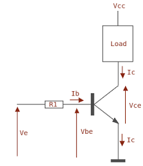

Résistances
===========

La résistance est un composant de base de l'électronique. Elle permet notamment de réduire des niveaux de tension.

Le calcul des résistances équivalente ainsi que d'autres calculs impliquant la résistance sont expliqués
dans la partie :doc:`/Electronique/Lois`.

Condensateurs
=============

Le condensateur est un composant de base de l'électronique. Il permet de lisser un niveau de tension. Il est aussi
utilisé pour réaliser du filtrage en fréquence.

Le calcul des condensateurs équivalents en parallèle se fait comme pour les résistances en série et le calcul
des condensateurs équivalents en série se fait quant à lui comme pour les résistances en parallèle.

Bobines
=======

Transistors & Mosfets
=====================

Transistor
**********

Le transistor permet de laisser passer ou non un courant pour alimenter un composant. Il en existe de deux types,
les NPN et les PNP, indiquant le sens dans lequel le courant doit le traverser. Le NPN est le plus utilisé
car il a de meilleures performances mais a le désavantage de laisser le composant toujours alimenté.

Le transistor a trois pôles, l'émetteur, le collecteur et la base. Le collecteur est le pôle sur lequel est branché
le composant qui doit être commandé. L'émetteur est le pôle connecté au reste du circuit. La base est le pôle
qui, selon le courant qui lui arrive, commande l'ouverture et la fermeture du circuit.

Le niveau de courant dans la base définit la capacité du transistor à laisser passer le courant. Plus Vce est petit,
mieux c'est.

Voici la recette magique de Pedrono pour dimensionner un transistor (voir son cours pour plus de détails) :

* Déterminer le besoin Ic (consommation du composant à commander)
* Estimer Hfe -> doc du transistor
* Calculer Ibmini = Ic / Hfe
* Calculer Ibchoisi = Ibmini x coef de sur-saturation
    * Ibmini < 1 mA -> 10 <= coef <= 20
    * Ibmini < 100 mA -> 3 <= coef <= 10
    * 100 mA < Ibmini -> 1 <= coef <= 3
* Calculer Rb = (Ve - 0.7) / Ibchoisi
* Choisir Rb parmi les résistances disponibles

Mosfet
******

Le mosfet a, comme le transistor, un rôle d'interrupteur. Cependant, il est commandé en tension et non en courant.
Ceci le rend plus simple d'utilisation, mais il a le désavantage d'être moins bien passant.

Régulateur linéaire
===================

Régulateur hacheur
==================

Amplificateur opérationnel
==========================

Diode
=====
