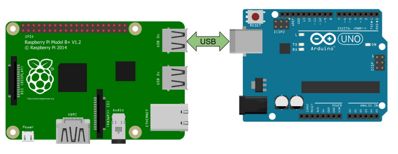

Arduino
=======

Liaison serie
=============

c quoi

La liaison serie entre une arduino est par exemple utiliser pour commander les moteurs ou receptionner les données des differents capteurs

Cote arduino
************

Envoyer
^^^^^^^

fonctionne exactement de la meme maniere que quand vous voulez ecrire dans le terminal arduino

.. code-block:: C++

	void setup() {
	  // put your setup code here, to run once:

	  Serial.begin(115200);
	  

	}

	void loop() {
	  // put your main code here, to run repeatedly:
	  Serial.println("coucou");

	}

Recevoir
^^^^^^^^

La reception est plus compliquer
Le principe est de recuperer un String et de decouper ce dernier pour retrouver les valeurs transmise

Un point important, par default l'arduino ne reception pas plus d'un message par seconde, en effet le parametre Serial.setTimeout est par default a 1000ms. ici nous avons du l'ecraser dans le setup a 15ms pour avoir un envoie bien plus rapide
il faut par contre faire attention a ne pas envoyer les messages trop vite, si l'arduino n'a pas eu le temps de process le precedant et qu'un nouveau lui est envoyer il est possible que cette derniere plante. en general une frequence d'evoie de 10~20hz est largement suffisante

.. code-block:: C++

	void setup() {

	  Serial.begin(115200);
	  Serial.setTimeout(15);

	}

	String received;
	int val1;
	int val2;

	void loop() {
	  delayMicroseconds(1);
	  
	  if(Serial.available()){
	    //lecture serie
	    received = Serial.readString();
	    int v1=0, v2=0, v3=0, v4=0, s1=0, s2=0, s3=0, s4=0;
	    sscanf(received.c_str(),"%d %d\n", &val1, &val2);
	       
	  }
	  
	}

Cote python
***********

Envoyer
^^^^^^^

Recevoir
^^^^^^^^

Les interuptions
================

interruptions sur un pin
************************

Une interruption sur un pin (ou une interruption externe) sur les microcontrôleurs Arduino permet de réagir immédiatement à un changement d'état (par exemple, passage de haut à bas ou de bas à haut) sur une broche spécifique. Cela permet d'interrompre l'exécution du programme principal pour effectuer une tâche spécifique en réponse à cet événement.

.. code-block:: cpp

	const int pinInterrupt = 2;
	volatile int state = LOW;

	void setup() {
	  pinMode(pinInterrupt, INPUT);
	  attachInterrupt(digitalPinToInterrupt(pinInterrupt), pinChange, CHANGE);
	}

	void loop() {
	  // Votre code principal
	}

	void pinChange() {
	  state = digitalRead(pinInterrupt);
	  // Code à exécuter en réponse à l'interruption
	}

interruptions sur timer
***********************

Les interruptions sur timer des Arduino sont des mécanismes permettant de programmer des actions à exécuter à des intervalles de temps réguliers ou à des moments précis en utilisant des compteurs internes. Cela permet de réaliser des tâches périodiques ou synchronisées sans interrompre le flux principal du programme.

Voici comment mettre en place une interuption sur le timer 3 avec arduino 

.. code-block:: cpp
	
	pinMode(36, OUTPUT); //creation d'un port temoin pour lire le signal
	volatile int period = 10000; //creation de la periode variable

	void setup() {

		noInterrupt(); //desactivation des interruptions le temps de travailler dessus
		TCCR3A = 0; //reset du registre A du timer 3
		TCCR3B = 0; //reset du registre B du timer 3
		TCCR3B |= B00000001; //ecriture dans le registre B du timer 3 pour definir qu'il n'y a pas de prescaler
		TCNT3 = 0; //remise a 0 du compteur
		OCR3A = period -1; //creation de la valeur de comparaison

		TIMSK3 |= (1 << OCIE3A); // on allume l'interuption sur la comparaison du timer

		interrupts(); et on fini par ralumer les interuptions
	}

	//ici la fonction de l'interuption, elle sera executer a chaque fois que la comparaison entre
	la valeur de OCR3A et celle du timer sera egale
	ISR(TIMER3_COMPA_vect){
		digitalWrite(13, !digitalRead(13)); //inversion du pin 13 pour faire tourner le moteur

  		OCR3A = period-1; // on reetabli la valeur de comparaison par securiter
		TCNT3 = 0; //on remet le compteur a 0
	}

	// la variable period peut etre modifier pendant l'evolution du programme
	//cela peut se faire directement dans la boucle loop ou dans une fonction via un message ROS ou serie par exemple.
	//cela se fait en inserant le block suivant:
	noInterrupts();
	period = newval;
	OCR3A = period - 1;
	interrupts();

il suffit maintenenant de dupliquer la partie presente dans le setup et le l'interruption en ramplacant les 3 par le numero de celui que vous souhaiter utiliser. De cette maniere chaque moteur fonctionera sur son interrution. attention, toute les carte arduino ne possede pas les meme timer dans le cas d'une arduino mega il y a 4 timer 16 bits ainsi le moteur 1er est controler par le timer1, le 2nd par le timer3, le 3eme par le timer4 et enfin le 4eme moteur par le timer5.

.. warning::

	la biliotheque servo.h utilise les timer afin de piloter des servomoteurs. a la compilation vous aurez donc une erreur indiquant la sur utilisation d'un vecteur. il est donc neccessaire de modifier la bibliotheque pour que cette derniere n'utilise pas le timer que nous utilisons.
	Pour cela diriger dans votre dossier d'instalation d'Arduino IDE. pour moi arduino-1.8.19. suivez ensuite le chemin suivant:
	arduino-1.8.19 > libraries > Servo > src > avr
	ouvre ensuite le fichier ServoTimers.h, trouvez ensuite les lignes suivantes qui correspondent a votre processeur, ici pour un arduino mega:

	.. code-block:: cpp

		// Say which 16 bit timers can be used and in what order
		#if defined(__AVR_ATmega1280__) || defined(__AVR_ATmega2560__)
		#define _useTimer5
		#define _useTimer1
		#define _useTimer3
		#define _useTimer4
		typedef enum { _timer1, _timer3, _timer4, _timer5, _Nbr_16timers } timer16_Sequence_t;

	nous allons devoir desactiver l'utilisation de notre timer. pour cela on retire tout simplement ce qui mentionne notre timer 3 tel que:
	cette action est evidement aplicable pour tout les timer qui devrais etre utiliser par des interuptions

	.. code-block:: cpp

		// Say which 16 bit timers can be used and in what order
		#if defined(__AVR_ATmega1280__) || defined(__AVR_ATmega2560__)
		#define _useTimer5
		#define _useTimer1
		#define _useTimer4
		typedef enum { _timer1, _timer4, _timer5, _Nbr_16timers } timer16_Sequence_t;

	nous pouvons maintenant rouvir ArduinoIDE et recompiler sans encombre notre programme

