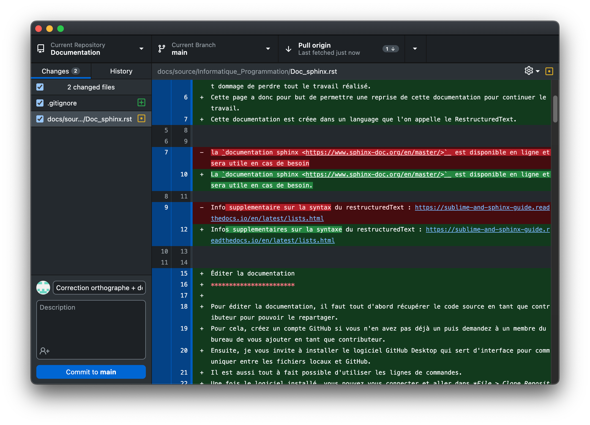
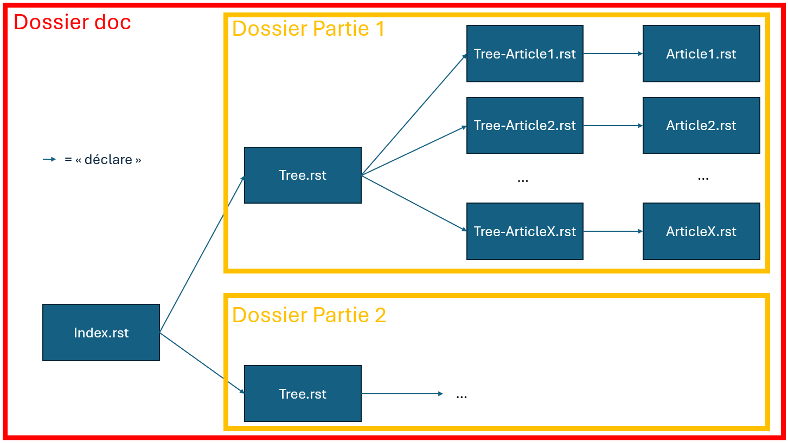

Introduction
============

Cette documentation a été commencée en 2022. L'objectif est de garder une trace du travail realisé par les membres du CRUBS entre 2021 et 2024. 
Ces 3 années ont été fructueuses avec un retour à la coupe de france de robotique et il serait dommage de perdre tout le travail réalisé. 
Cette page a donc pour but de permettre une reprise de cette documentation pour continuer le travail. 
Cette documentation est créee dans un language que l'on appelle le RestructuredText.

La `documentation sphinx <https://www.sphinx-doc.org/en/master/>`_ est disponible en ligne et sera utile en cas de besoin.

Infos supplementaires sur la syntaxe du restructuredText : https://sublime-and-sphinx-guide.readthedocs.io/en/latest/lists.html

Éditer la documentation
***********************

Pour éditer la documentation, il faut tout d'abord récupérer le code source en tant que contributeur pour pouvoir le repartager.
Pour cela, créez un compte GitHub si vous n'en avez pas déjà un puis demandez à un membre du bureau de vous ajouter en tant que contributeur.
Ensuite, je vous invite à installer le logiciel GitHub Desktop qui sert d'interface pour communiquer entre les fichiers locaux et GitHub. 
Il est aussi tout à fait possible d'utiliser les lignes de commandes.
Une fois le logiciel installé, vous pouvez vous connecter et aller dans *File > Clone Repository*. 
Normalement le logiciel devrait vous proposer le dépôt de la documentation. Vous pouvez ainsi le cloner sur votre PC. Vous pouvez aussi retrouver le dépôt sur le `GitHub du CRUBS <https://github.com/CRUBS/Documentation>`_.

Une fois le dépôt cloné, vous pouvez maintenant modifier la documentation.

Pour envoyer vos modifications sur le serveur, rendez-vous sur GitHub Desktop. 
Dans le panneau de droite, vous avez vos modifications qui sont indiquées, à gauche, les fichiers modifiés, en desssous, 
une zone de texte pour indiquer un résumé des modifications et en dessous un zone pour développer les modifications, si vous le souhaitez.
Ensuite cliquez sur *commit to main* puis *push*.

Pour récupérer des modifications depuis le serveur, cliquez sur *Fetch* puis *Pull*, sur le bouton en haut de la fenêtre.

Commencement
============

Installation
************

Windows
^^^^^^^

.. code-block:: bash

	pip install -U sphinx

linux (Debian / Ubuntu)
^^^^^^^^^^^^^^^^^^^^^^^

.. code-block:: bash

	apt-get install python3-sphinx

Génération
**********

Si vous souhaitez démarrer votre propre projet, vous pouvez utiliser la commande suivante :

.. code-block:: bash

	sphinx-quickstart

Cette étape n'est pas nécessaire si vous souhaitez simplement participer à la documentation du CRUBS.

Toctree, index et ordonnancement des fichiers
*********************************************

Explications :
^^^^^^^^^^^^^^

L'ordonnancement des fichiers de la documentation se fait d'une certaine manière qu'il faut continuer de suivre
pour garder une certaine cohérence.

Le concept important à comprendre est celui de "toctree". Un toctree est un fichier *.rst* qui créer un sommaire,
une arborescence et déclare ainsi les articles à afficher dans la documentation.

La documentation est organisée de la manière suivante:

.. code-block:: text

	Documentation
	├─index.rst
	├─Dossier_partie_1
	|	├─Tree.rst
	|	├─Tree_Article_1.rst
	|	├─Tree_Article_2.rst
	|	├─Tree_Article_X.rst
	|	├─Article_1.rst
	|	├─Article_2.rst
	|	├─ . . .
	|	└─Article_X.Rst
	|
	├─Dossier_partie_2
	|	├─Tree.rst
	|	├─Tree_Article_1.rst
	|	├─Tree_Article_2.rst
	|	├─Tree_Article_X.rst
	|	├─Article_1.rst
	|	├─Article_2.rst
	|	├─ . . .
	|	└─Article_X.Rst
	. . . 
	└─Dossier_partie_X
		└─ . . .

Le fichier "index.rst" doit impérativement porter ce nom, une fois compilé ce dernier portera le nom de "index.html"
et permettra d'ouvrir la documentation. Ce dernier est le sommaire principal de la doc. C'est donc un toctree
dans lequel vous devez appeler le fichier "Tree.rst" de chaque partie. par exemple (index de la doc) :

.. code-block:: rst

	Bienvenue sur la documentation du CRUBS!
	========================================

	.. toctree::
	   :maxdepth: 2
	   :numbered:
	   :caption: Contents:

	   Gestion/Tree
	   Informatique_Programmation/Tree
	   Robot-2023/Tree
	   Robot-2024/Tree
	   Voron-0.1/Tree
	   CAO/Tree
	   FAO/Tree

Le fichier "Tree.rst" présent dans chaque partie permet de créer le sommaire de la partie, il appelle les sommaires
de chaque article. Par exemple (Tree de la partie FAO) :

.. code-block:: rst

	FAO
	===

	Fabrication Assisté par Ordinateur

	.. toctree::
	   :maxdepth: 2

	   Tree-PrusaSlicer
	   Tree-CharlyRobot
	   Tree-CIF
   

Enfin, le fichier "Tree-XXXXXX.rst" permet de créer un sommaire intermédiaire pour chaque article. Un article a alors
son sommaire (toctree). On retrouve alors un seul fichier de déclarer, par exemple (Tree-PrusaSlicer.rst) :

.. code-block:: rst

	PrusaSlicer
	===========

	Logiciel de préparation des fichiers gcode pour l'impression 3D.

	.. toctree::
	   :maxdepth: 1
	   :caption: Contents:

	   PrusaSlicer

.. note::

	Notez que les toctree sont seulement des "fonctions" au sein d'un fichier *rst*. Il est donc tout à fait possible d'ajouter des notes, des images, des tableaux, etc, dans un sommaire pour les rendre plus vivants, par exemple :
	:doc:`/Informatique_Programmation/Tree-Doc_sphinx` 

Pour résumer schématiquement, voilà ce que ça donne :

À vous de jouez :
^^^^^^^^^^^^^^^^^

.. tip::

	**Vous voulez créer une partie :**

	#. Ajouter un dossier à la racine de la doc
	#. Préparer un dossier "Tree.rst" pour les futurs articles dans ce dossier
	#. Ajouter ce fichier "Tree.rst" dans le fichier "index.rst" à la suite des autres : "Nom_partie/Tree"

.. tip::

	**Vous voulez créer un nouvel article dans une partie existante, dans un même dossier :**

	#. Créer votre article "Nom_article.rst" comme vous le souhaitez
	#. Créer un toctree "Tree-Nom_article.rst", servez-vous des existants comme exemple
	#. Ajouter l'article que vous avez créé au toctree qui lui est dédié que vous venez de créer
	#. Ajouter le toctree de votre article à "Tree.rst" à la suite des autres: "Tree_Nom-article"

.. warning::

	N'oubliez pas d'envoyer régulièrement votre travail sur Github (commit et push). La documentation est recompilée en ligne et est actualisé automatiquement quelques minutes après le push.

Compilation
***********
Pour ne pas toujours avoir besoin de push sur github vos modifications et attendre la mise à jour de la doc,
il est possible de compiler cette dernière en local.

Vous pouvez récupérer les fichier make.bat et Makefile, disponible sur
`Github <https://github.com/CRUBS/Documentation/tree/main/docs>`_

Ajoutez ces fichiers à la racine des fichiers de la documentation (comme sur Github) puis vous pouvez exécuter
la compilation dans un terminal de la manière suivante :

.. code-block:: bash

	make html

De cette manière un dossier 'build' sera généré et vous trouverez dans ce dernier un fichier 'index.html',
ouvrez-le avec votre navigateur web préféré et voilà !

Généralités
===========

Titres
******

.. code-block:: rst

	ceci est texte

	ici un titre principale
	=======================

	maintenant un titre secondaire
	******************************

	et enfin un titre tertiaire
	^^^^^^^^^^^^^^^^^^^^^^^^^^

Format de texte
***************

.. code-block:: rst

	texte en *italique*

texte en *italique*

.. code-block:: rst

	texte en **gras**

texte en **gras**

Liste et énumération
********************

Liste numerotée

.. code-block:: rst

	#. point 1
	#. point 2
	#. point 3

#. point 1
#. point 2
#. point 3

Liste à points

.. code-block:: rst

	* point 1
	* point 2
	* point 3

* point 1
* point 2
* point 3

Tableaux
********

Notes
*****

.. code-block:: rst
	
	.. note::
		ceci est une note

.. note::
	ceci est une note

Warnings
********

.. code-block:: rst

	.. warning::
		ceci est un warning

.. warning::
	ceci est un warning

Astuces
*******

.. code-block:: rst

	.. tip::
		ceci est une astuce

.. tip::
		ceci est une astuce

Dangers
*******

.. code-block:: rst

	.. danger::
		ceci est un danger

.. danger::
		ceci est un danger

Ajout de médias
===============

.. warning::
    Attention les syntaxes sont à respecter impérativement, les tabulations, sauts de ligne, espaces, etc ...

Bloc de code
************

Exemple d'un bloc de code à ajouter à la page, vous pouvez évidement remplacer "python" par le langage que vous utilisez.

.. code-block:: rst

	.. code-block:: python

		import math

		def main():
			print("Hello World !")

		if __name__ == "__main__":
			main()

Images
******

.. code-block:: rst

	.. image:: chemin/de/limage.png
	   :scale: 20 %
	   :align: center
	   :class: with_shadow float_right

Ici, l'image est redimensionnée à 20% de sa taille originale et est alignée au centre de la page horizontalement.
La ligne *class*, permet de la placer à droite de la page sans faire descendre le texte, ce que j'utilise
pour les toctree de chaque sujet.

Beaucoup de paramètres existent dans la doc.

Hyperlien
*********

.. code-block:: rst

	Ceci est un `exemple de lien <page_web.html>`_

Ceci est un `exemple de lien <https://www.youtube.com/watch?v=dQw4w9WgXcQ>`_

Lien dans la documentation
**************************

.. code-block:: rst

	:doc:`/Informatique_Programmation/Tree-Doc_sphinx`

:doc:`/Informatique_Programmation/Tree-Doc_sphinx`

